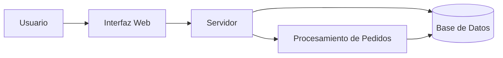

# Tienda Online

Tienda Online es un proyecto de práctica desarrollado para aprender y aplicar Markdown avanzado en GitHub.

## Descripción

Este proyecto representa una tienda virtual básica donde se pueden organizar productos y gestionar pedidos.

## Características

El proyecto busca presentar de manera sencilla las principales funciones de una tienda online.

## Funcionalidades

| Funcionalidad         | Estado        |
| --------------------- | ------------- |
| Catálogo de productos | Completado    |
| Registro de usuarios  | Completado    |
| Carrito de compras    | En desarrollo |
| Sistema de pagos      | Pendiente     |
| Historial de pedidos  | Pendiente     |
| Clientes recomendados | Pendiente     |

- [x] Crear el repositorio
- [ ] Implementar sistema de pagos

# Tienda Online

## Arquitectura

