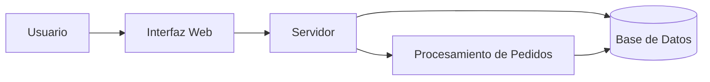

# 🛒 Tienda Online


Tienda Online es un proyecto de práctica desarrollado para aprender y aplicar Markdown avanzado en GitHub.
El proyecto representa una tienda virtual donde los usuarios pueden consultar productos y gestionar sus pedidos.

## 📑 Tabla de contenidos

- [Descripción](#descripcion)
- [Instalación](#instalacion)
- [Uso](#uso)
- [Funcionalidades](#funcionalidades)
- [Tareas pendientes](#tareas-pendientes)
- [Arquitectura](#arquitectura)
- [Contribuidores](#contribuidores)

## 📋 Descripción

El proyecto simula una tienda online básica. Su objetivo es presentar de manera organizada las principales funciones de una tienda virtual y demostrar el uso de herramientas de Markdown avanzado y desarrollado.

## ⚙️ Instalación

Para instalar el proyecto, primero se debe clonar el repositorio y acceder a su carpeta:

```bash
git clone https://github.com/marxpurguaya-lan/laboratorio-readme.git
cd laboratorio-readme
```

## ▶️ Uso

Para abrir el proyecto en Visual Studio Code se puede utilizar el siguiente comando:

```bash
code .
```

Después de abrir el proyecto, se puede revisar el archivo `README.md` y los demás recursos disponibles.

## 🚀 Funcionalidades

| Funcionalidad         | Estado        |
| --------------------- | ------------- |
| Catálogo de productos | Completado    |
| Registro de usuarios  | Completado    |
| Carrito de compras    | En desarrollo |
| Sistema de pagos      | Pendiente     |
| Historial de pedidos  | Pendiente     |

## 📝 Tareas pendientes

- [x] Crear el repositorio en GitHub
- [x] Crear el README
- [x] Agregar un badge
- [x] Crear la tabla de funcionalidades
- [x] Agregar el diagrama Mermaid
- [ ] Implementar el sistema de pagos
- [ ] Agregar historial de pedidos
- [ ] Realizar pruebas finales

## 🏗️ Arquitectura



## 👨‍💻 Contribuidores

**Marx Arturo Purguaya Vilca**

GitHub: `marxpurguaya-lan`

Estudiante de Diseño y Desarrollo de Software en Tecsup.
